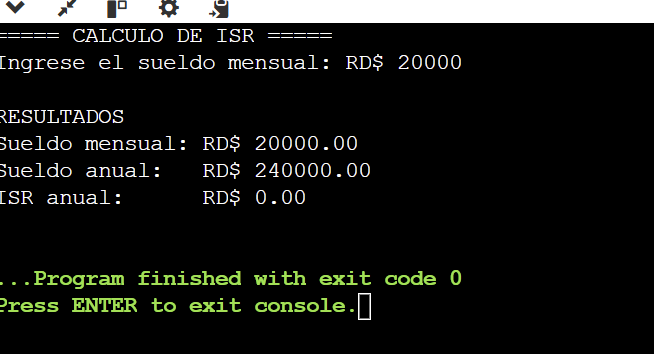
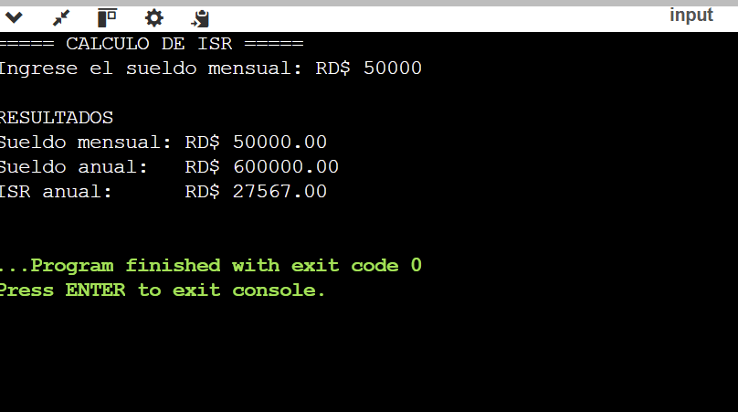

# Actividad 2 - Flujo de Control

Este programa en C++ calcula el **ISR (Impuesto Sobre la Renta)** de un empleado en República Dominicana.  
El usuario ingresa el sueldo mensual y el programa muestra:

- Sueldo mensual
- Sueldo anual
- ISR anual correspondiente

---

## Ejemplos de ejecución

### Sueldo mensual: RD$20,000
Sueldo anual: RD$240,000  
ISR anual: RD$0  

### Sueldo mensual: RD$50,000
Sueldo anual: RD$600,000  
ISR anual: RD$27,567  

---

## Conclusión
El programa funciona correctamente y calcula el ISR en base al sueldo ingresado.
